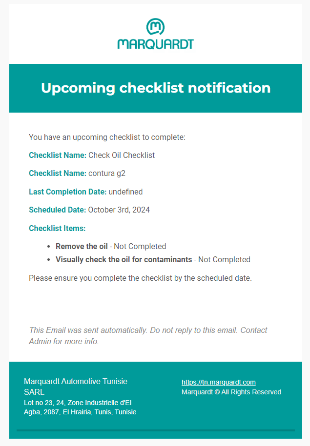
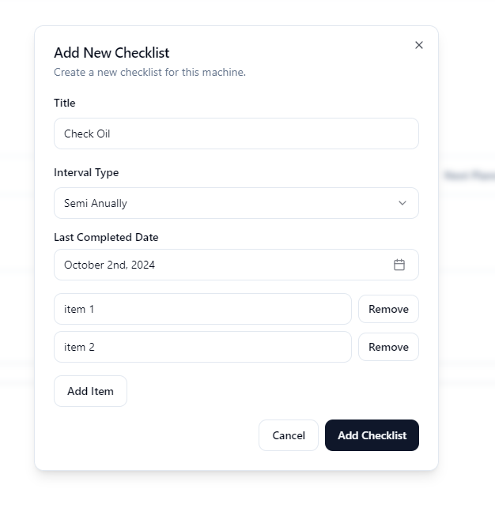
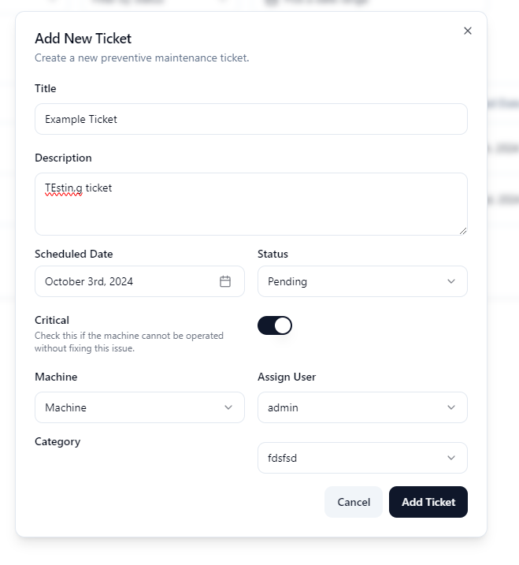
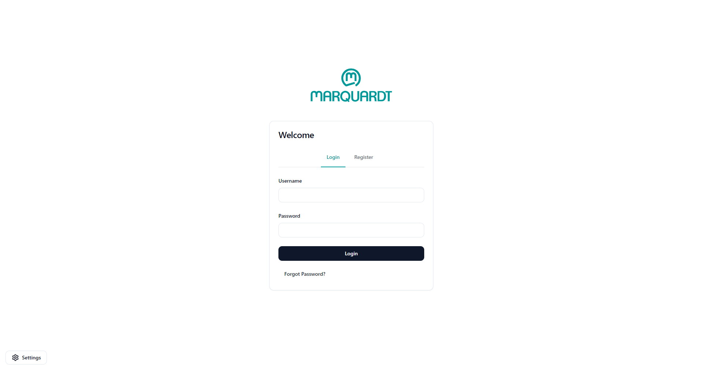

# Maintenance Manager Application


A comprehensive solution for managing and tracking machine maintenance, spare parts, accessories, and more. This app provides tools to streamline preventive and corrective maintenance, send notifications, generate reports, and track maintenance statistics.

## Features

- **Machine Management**: Track machine details, documents, and statuses.
- **Spare Parts & Accessories**: Assign spare parts and accessories to machines.
- **Preventive Maintenance**: Set and manage preventive maintenance checklists.
- **Corrective Maintenance**: Log tickets for corrective maintenance with detailed information.
- **User Management**: Manage user accounts and roles for better access control.
- **Email Notifications**: Automated email notifications for checklists, tickets, and updates.
- **Report Generation**: Create comprehensive maintenance reports in PDF format.
- **Statistics & Insights**: Get detailed insights and statistics related to maintenance performance.

## Tech Stack

- **Frontend**: React (with Vite) and Shadcn UI library for a modern, responsive interface.
- **Backend**: SQLite with Drizzle ORM for managing data storage.
- **Desktop Framework**: Electron.js for cross-platform desktop application development.
- **Styling**: Tailwind CSS for custom, responsive designs with dark mode support.
- **Other Tools**:
  - FastAPI for backend API management.
  - LaTeX for report formatting.
  
## Installation

1. **Clone the repository**:
    ```bash
    git clone https://github.com/MayseenAidoudi/MaintenanceApp.git
    cd MaintenanceApp
    ```

2. **Install dependencies**:
    ```bash
    npm install
    ```

3. **Run the development server**:
    ```bash
    npm run dev
    ```

4. **Build the app** (for Electron):
    ```bash
    npx electron-vite build
    //For building a portable version choose win=portable, else choose any target that electron-builder supports.
    npx electron-builder --win=portable
    ```

## Usage

1. **Managing Machines**: Add machines, assign spare parts and accessories, and track their maintenance status.
2. **Preventive Maintenance**: Schedule regular maintenance tasks and receive notifications when they are due.
3. **Generate Reports**: Export detailed maintenance reports in PDF format.
4. **Email Notifications**: Automatically send reminders and updates regarding maintenance activities.

## Screenshots

### Email of A Checklist


### Form For Creating A Checklist


### Form For Adding A Ticket


### Login Screen



## Contributing

1. Fork the repository.
2. Create a new branch (`git checkout -b feature/your-feature`).
3. Commit your changes (`git commit -m 'Add new feature'`).
4. Push to the branch (`git push origin feature/your-feature`).
5. Create a pull request.

## License

This project is licensed under a custom license. See the [LICENSE](./LICENSE.md) file for details.

## Acknowledgments

- Thanks to everyone involved in the development and design of this app.
